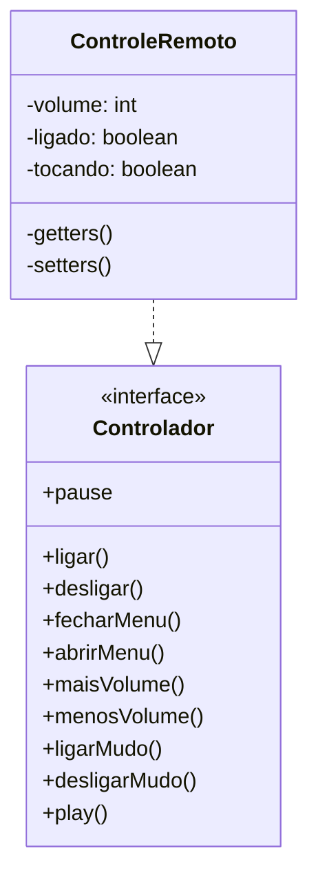

```mermaid
classDiagram
    class Controlador{
        +ligar()
        +desligar()
        +fecharMenu()
        +abrirMenu()
        +maisVolume()
        +menosVolume()
        +ligarMudo()
        +desligarMudo()
        +play()
        +pause
   <<interface>>
    }
    class ControleRemoto{
        -volume: int
        -ligado: boolean
        -tocando: boolean
        
        -getters()
        -setters()
    }
    
    ControleRemoto ..|> Controlador

```
